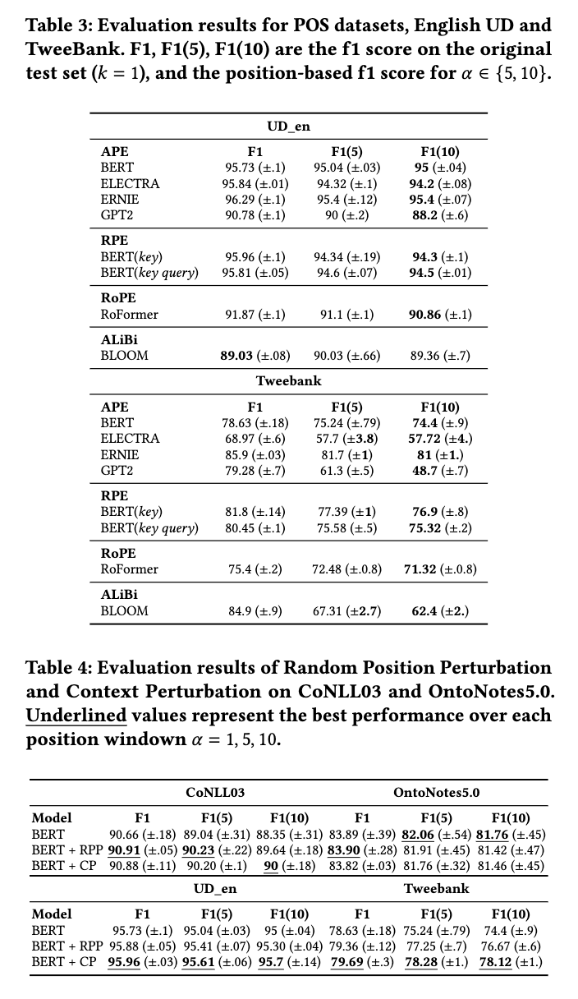

# Impact of Positional Bias on Language Models in Token Classification

This repository contains source code for [Impact of Positional Bias on Language Models in Token Classification](https://arxiv.org/abs/2304.13567).

Accepted at [ACM SAC 2024](https://doi.org/10.1145/3605098.3636126)


## Abstract
```
Language Models (LMs) have shown state-of-the-art performance
in Natural Language Processing (NLP) tasks. Downstream tasks
such as Named Entity Recognition (NER) or Part-of-Speech (POS)
tagging are known to suffer from data imbalance issues, particu-
larly regarding the ratio of positive to negative examples and class
disparities. This paper investigates an often-overlooked issue of
encoder models, specifically the position bias of positive examples
in token classification tasks. For completeness, we also include de-
coders in the evaluation. We evaluate the impact of position bias
using different position embedding techniques, focusing on BERT
with Absolute Position Embedding (APE), Relative Position Embed-
ding (RPE), and Rotary Position Embedding (RoPE). Therefore, we
conduct an in-depth evaluation of the impact of position bias on
the performance of LMs when fine-tuned on token classification
benchmarks. Our study includes CoNLL03 and OntoNote5.0 for
NER, English Tree Bank UD_en, and TweeBank for POS tagging.
We propose an evaluation approach to investigate position bias in
transformer models. We show that LMs can suffer from this bias
with an average drop ranging from 3% to 9% in their performance.
To mitigate this effect, we propose two methods: Random Position
Shifting and Context Perturbation, that we apply on batches during
the training process. The results show an improvement of ≈ 2% in
the performance of the model on CoNLL03, UD_en, and TweeBank.
```

## Dependencies

    - datasets==2.5.1
    - tokenizers==0.12.1
    - transformers==4.22.1
    - torch==1.12.0
    - wandb==0.13.4
    - seaborn==0.12.1
    - seqeval==1.2.2


## Setup

* Install the conda environment
The environment used can reproduced by using `p-22-ner-position-bias.yml`
```shell
conda env create -f p-22-ner-position-bias.yml
```

## Positional Bias in Named Entity Recognition and Part of Speech taggin
In this repository, we evaluate the performance of BERT model with different position encodings on two datasets [conll03](https://www.clips.uantwerpen.be/conll2003/ner/) and [Ontonotesv5](https://catalog.ldc.upenn.edu/LDC2013T19) for NER and [UD English Web TreeBank](https://github.com/UniversalDependencies/UD_English-EWT) and [TweeBank](https://github.com/Oneplus/Tweebank).

### Positional Encodings
We study the following positional encodings:
- Absolute Positional Encoding (APE): [Vaswani et al. (2017)](https://arxiv.org/abs/1706.03762)
- Relative Positional Encoding (RPE): [Shaw et al. (2018)](https://arxiv.org/abs/1803.02155)
- Relative key-query Positional Encoding (RKPE): [Huang et al. (2021)](https://arxiv.org/abs/2106.04554)
- Rotational Positional Encoding (RoPE): [Huang et al. (2021)](https://arxiv.org/abs/2106.04554)


### Experiments:
Under the folder `experiments/scripts`,
#### 1. Position Bias Analysis

- Encoder Models: BERT, ERNIE, ELECTRA

        ./run_all_evaluations.sh
 
- Decoder Models: GPT2 and BLOOM

        ./run_all_evaluations_decoders.sh


#### 2. Fine-tuning with Random Position Perturbation, Context Perturbation

        ./run_all_finetuning.sh



### Results
All evaluation results and log files are synced to the Weights and Biases and will be published.
